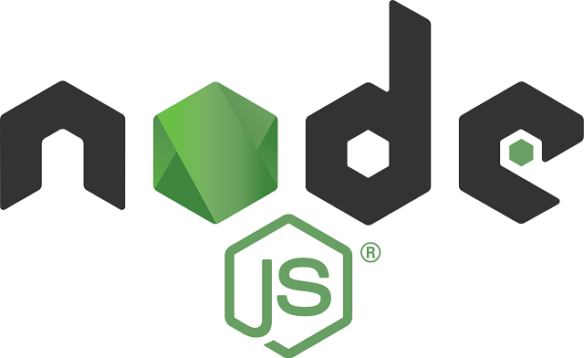

# NODE JS

Node.js is an open-source, cross-platform, back-end JavaScript runtime environment that runs on the V8 engine and executes JavaScript code outside a web browser.

- [Download node.js](https://nodejs.org/en/)
- [Node.js documentation](https://nodejs.org/en/docs/)

After successful installation of node.js, continue to theinstallation of your preferred **Package Manager**.
